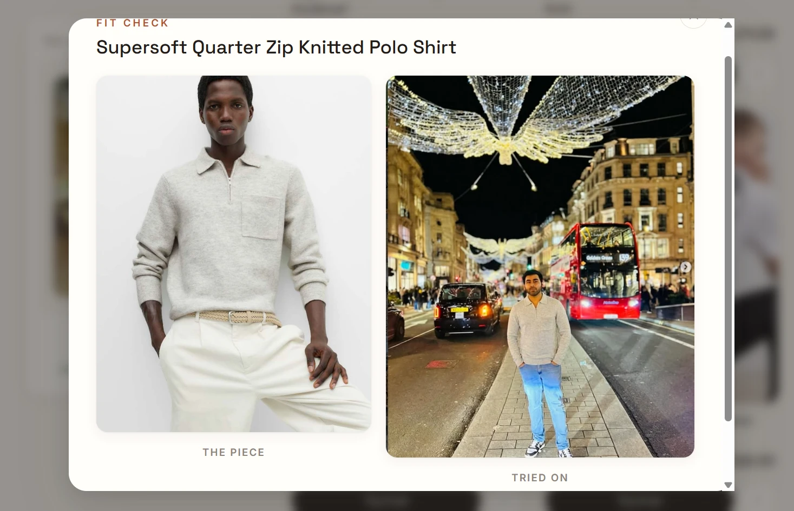
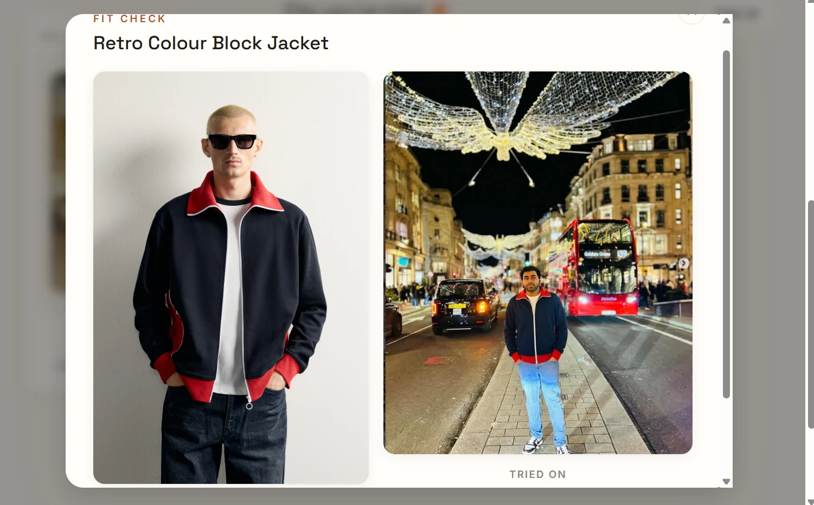
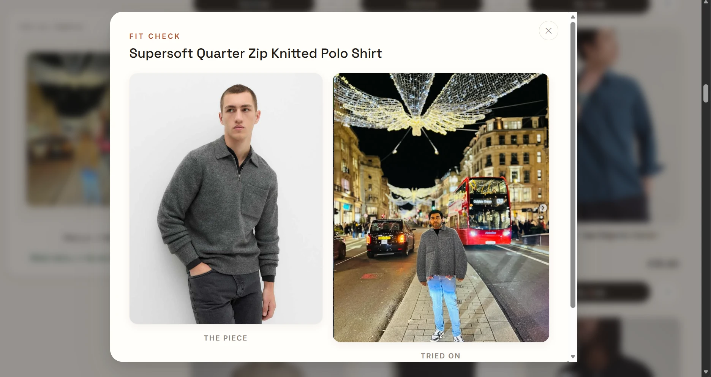
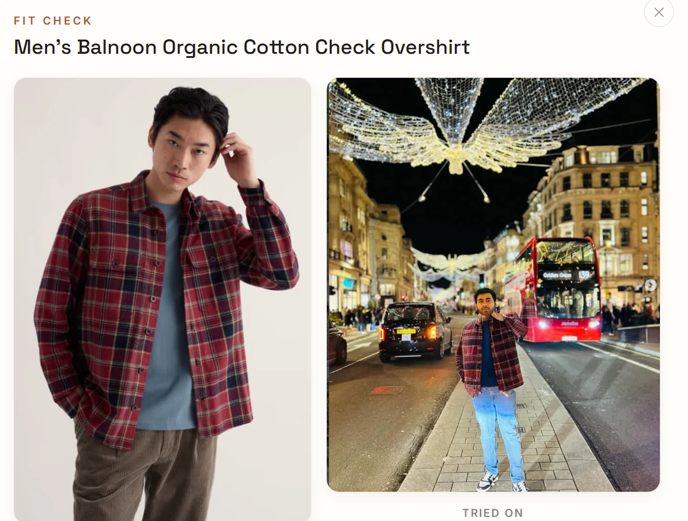

# Drip Lab 🛍️ live fashion search + AI virtual try-on

Search six UK fashion retailers at once (**Zara, H&M, boohoo, M&S, River Island,
Seasalt**; women's and men's), then see any item **on your own photo** before
you buy it.

**Try the free edition live: https://drip-lab.onrender.com**
(free hosting, so the first visit after a quiet spell takes ~1 minute to wake
up, and the free try-on allowance is shared between visitors.)

Or run it on your own computer with your own API key, which is faster and has
no shared limits.

## How to use it

1. **Pick Women or Men**, then search for what you want  *"linen shirt"*,
   *"black tee"*, *"floral midi dress"*, *"wide-leg jeans"*. Results come live
   from the stores, so the first search takes a few seconds. You can also tap a
   **Trending** search, or browse with the type chips (All, Tops, T-shirts,
   Shirts, Jeans…).
2. **Narrow it down** with **Stores ▾** (switch shops on or off), **Price ▾**
   (under £15 / £25 / £40 / £60) and **Sort** (recommended, or price). Whatever
   is on shows as a pill next to *Active:*, and **Clear** resets it.
3. **Add your photo**  click **Try on with your photo** (or **My photo** in the
   top bar) and upload one picture. Use a **full-body, portrait photo, standing
   and facing the camera**; a mirror selfie is ideal. Upload it once and it's
   reused for everything.
4. **Press "Try it on"** on any item. The AI dresses you in that garment while
   keeping your face, pose and background. On the free hosted site it takes
   30 s – 2 min; running it yourself with Gemini takes about 10 s.
5. **Keep what you like.** Every result lands in **"Fits you've tried"**  click
   one to see it large, **Save it** to download, or **Cop it →** to open the
   shop page. **♡** on any card saves it to **Saved**. **Clear all** deletes
   your try-on images.

**Tips:** trying the same item twice is instant and free (results are cached),
and items with a plain garment photo (many M&S and Zara pieces) give the best
try-ons.

---

## See it in action

**60-second demo** — search, filter, and try an item on a real photo:

https://github.com/riishabhz/Tryon/raw/main/docs/demo.mp4

<video src="https://github.com/riishabhz/Tryon/raw/main/docs/demo.mp4" controls width="720"></video>

Real results from the app's **Fit check** view: the shop's product photo on the
left, and the same item tried on a real photo (the author's, on Regent Street) on
the right.

### Gemini edition

| M&S Supersoft Quarter Zip Knitted Polo | Retro Colour Block Jacket |
|---|---|
|  |  |

### Free edition (Hugging Face)

| M&S Supersoft Quarter Zip Knitted Polo | Men's Balnoon Organic Cotton Check Overshirt |
|---|---|
|  |  |

**What the examples show:** both editions keep your face, the scene and your
other clothes (the jeans and trainers are untouched). Gemini fits the garment
closely to your body and pose. The free edition gets the colour and pattern
right, but the fit is looser, bits of your original outfit can show through
(see the cuffs on the polo), and it may change your arm position (the raised
hand on the overshirt comes from the product photo).

### How a try-on works

1. **You upload one photo** of yourself, ideally full-body and standing. It's
   saved on your computer and reused for every try-on.
2. **You click "Try it on"** on any product in the search results.
3. **The app picks the best garment picture.** Where the store has one, it uses
   a photo of the garment on its own, with no model (M&S cut-outs, Zara
   flat-lays), so the AI has no other person to copy.
4. **Your photo and the garment go to the AI you chose:**
   - **Gemini** is told to keep your face, body, pose, framing and background,
     replace only that garment, and never copy the shop model or their
     accessories. The output keeps your photo's shape.
   - **The free models** re-dress the upper or lower body. The app then pastes
     only the new clothing back onto your original photo, so your face, hair
     and background stay exactly as they were (when IDM-VTON handles the
     request, which is the usual case).
5. **The result appears** next to the product photo, gets saved to "Fits you've
   tried", and can be downloaded. Trying the same item again is instant and
   free, because results are cached.

---

## Two versions: pick one

The website is the same in both. They differ only in the AI that does the
try-on.

| | [`tryon-gemini/`](tryon-gemini/README.md) ⭐ recommended | [`tryon-kolors/`](tryon-kolors/README.md) |
|---|---|---|
| **AI engine** | Google Gemini image model | Free open-source models on Hugging Face (Kolors, IDM-VTON, CatVTON, Leffa) |
| **Cost** | About **3p (≈ $0.04) per try-on** | **Free** |
| **Speed** | ~10–15 seconds | 30 seconds – 2 minutes (shared queue) |
| **Daily limit** | Only your billing budget | **Roughly 5–10 try-ons/day** without an account; **a few dozen** with a free Hugging Face token |
| **Reliability** | High | The free services are sometimes busy, out of quota or offline |
| **Quality** | Keeps your face, pose and background; works with most photos | Good with a clear full-body photo; struggles with close-ups |
| **Needs** | A Google API key **with billing enabled** | Nothing (an HF token is optional) |

### Which should I use?

- **Just want to try it for free?** Use **`tryon-kolors`**. It works, but the
  free GPU allowance runs out after a handful of try-ons a day, and you may
  wait in a queue. When it runs out, the app says so; wait a while or switch
  to Gemini.
- **Want it fast and reliable?** Use **`tryon-gemini`**. A few pounds of
  Google credit covers about 100 try-ons, with no queue and no daily cap.

You can install both and switch whenever you like. They run on different ports
(8001 and 8000).

## Quick start

1. Install **Python 3.11** from https://www.python.org/downloads/ (on Windows,
   tick **"Add python.exe to PATH"** during setup).
2. Open the folder of the version you picked and follow its README:
   - [tryon-gemini/README.md](tryon-gemini/README.md)
   - [tryon-kolors/README.md](tryon-kolors/README.md)

In short:

```bash
cd tryon-gemini
pip install -r requirements.txt
python -m uvicorn main:app --port 8001
```

Then open **http://localhost:8001** in your browser.

## Features

- **Live search across 6 stores at once.** Type *"black t-shirt"*, *"linen
  shirt"* or *"floral midi dress"*.
- **Women / Men toggle**, clothing-type chips (T-shirts, Shirts, Jeans,
  Dresses…) and a **Filters** panel (stores, max price, sort by price).
- **Understands the query.** *"black mens t-shirt"* sets Men, T-shirts and the
  colour black for you.
- **Virtual try-on.** Upload one photo, click **Try it on** on any product, and
  see yourself wearing it. Every try-on is kept in **"Fits you've tried"**,
  which has a **Clear all** button.
- **Back-button friendly.** Open a product in the shop, come back, and your
  results and scroll position are still there.

## Hosting it yourself

`tryon-kolors/` includes a `Dockerfile`, so the free edition can be hosted
(Render, Fly.io, a VPS, or anywhere that runs Docker). The image sets
`DRIPLAB_MULTIUSER=1`, which gives **every visitor a private photo and
gallery**, identified by a random ID their browser sends, deleted after a day,
with one try-on at a time each.

Useful settings:

| Variable | What it does |
|---|---|
| `DRIPLAB_MULTIUSER=1` | Private photo and gallery per visitor (set by the Dockerfile) |
| `DRIPLAB_DISABLED_STORES` | Comma-separated stores to switch off, e.g. `zara`. Some stores block requests from cloud servers even though they work fine from a home connection |
| `HF_TOKEN` | Optional Hugging Face token; raises the free try-on allowance, shared by all visitors |

Note that hosted try-ons all share one free allowance, so a busy day means
"quota exceeded" for visitors.

## Engineering notes

Some of the more interesting problems solved along the way:

- **Every store needed a different approach.** M&S embeds its catalogue as
  Next.js `__NEXT_DATA__` JSON. River Island and Seasalt render product HTML on
  the server. Zara's pages sit behind a bot check, but its category JSON feed
  doesn't. H&M blocks its website to scripts while exposing a search API.
  boohoo renders products in the browser from Algolia, so the app queries the
  same public search index its own site uses.
- **Fixing try-on "face swaps".** With a head-and-shoulders photo, the image
  model pasted the user's head onto the product model's body, sunglasses and
  all. The fix: a stricter prompt (keep the customer's framing and body, never
  copy the model or accessories), an output aspect ratio matched to the user's
  photo, and **garment-only images** (M&S cut-outs, Zara flat-lays) where a
  store provides them.
- **Free models at a fixed 768×1024.** They re-draw the whole picture, which
  loses small faces and stretches photos. The app now pastes only the
  re-dressed clothing back onto the original photo, protecting the whole head
  by finding the face-shaped gap in the model's own edit mask.
- **Zara's categories are loose.** Its "dresses" feed includes blazers, so its
  items are also filtered by Zara's own garment-family labels.
- **Colour search where names don't include colour.** M&S product names omit
  colour, so colour is read from variant data and searched alongside the name.
- **Search that survives the Back button.** Search state lives in the URL and
  session storage, so returning from a shop page restores results and scroll
  position with no new requests.

## Tech stack

Python · FastAPI · Uvicorn · vanilla JavaScript/HTML/CSS (no build step) ·
Docker · Google Gemini API · Hugging Face `gradio_client` · Pillow

## Privacy and your API key

- Your key lives only in a `.env` file on your computer. **Never share that
  file or upload it to GitHub**; the included `.gitignore` keeps it out of Git.
- Your photo stays on your computer and is sent only to the try-on AI you chose
  (Google, or a Hugging Face Space). Only upload photos of yourself or of
  people who have agreed.

## Author and licence

Built by **Rishabh Bhardwaj**  [LinkedIn](https://www.linkedin.com/in/rishabh-data-analytics/).

**Personal, non-commercial use only**  see [LICENSE](LICENSE). You're welcome
to run it, read it, learn from it and adapt it for yourself; selling it,
hosting it as a paid or ad-supported service, or using it commercially needs
my written permission.

## Disclaimer

A personal, educational project, **not affiliated with or endorsed by** any of
the retailers. Product data and images belong to the retailers; they're fetched
live for personal use and never redistributed. Stores change their websites,
so a store can stop working at any time; the others carry on, and the app shows
which store failed. The free engine's models are licensed for **non-commercial
use only**.
